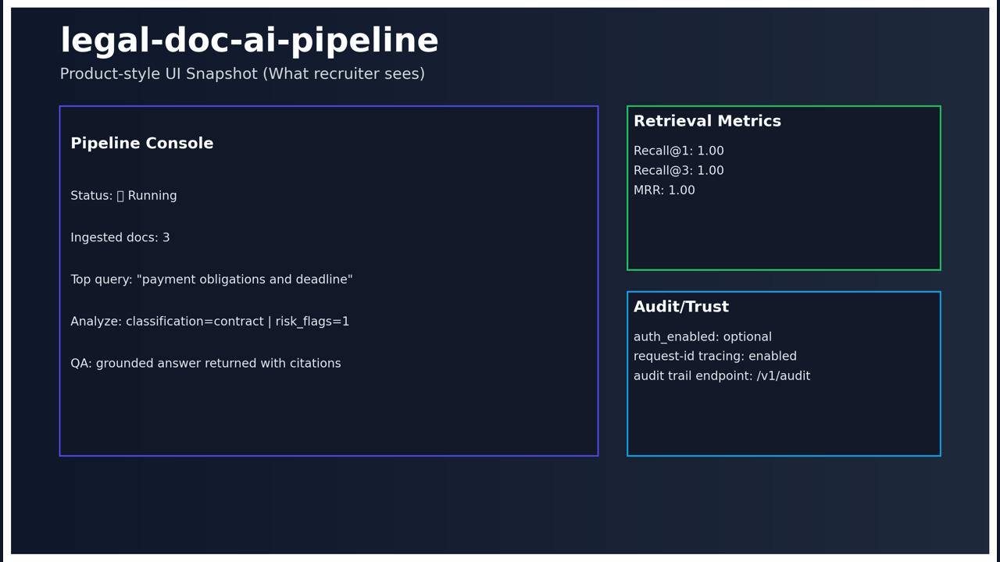

# Hi, I'm Kerem Ercin
### Python Automation Engineer | Document AI, RAG, APIs, Internal Tools

I build practical Python systems that turn messy documents, web data, and manual workflows into reliable software.

- Python, FastAPI, SQL, PostgreSQL, web scraping, OCR/PDF extraction, and RAG
- API-first automation with structured outputs, tests, observability, and clear failure handling
- Remote async collaboration from Turkey (UTC+3)

**Best fit:** document workflows, support and lead intake, data extraction, API integrations, internal tools, and AI features that need grounded outputs rather than a fragile chatbot demo.

---

## Selected Proof

### 1) [legal-doc-ai-pipeline](https://github.com/keremercin/legal-doc-ai-pipeline)
OCR/PDF ingestion, hybrid retrieval, grounded Q&A, citations, audit trail, FastAPI endpoints, tests, CI, and benchmark artifacts.

### 2) [ai-automation-toolkit](https://github.com/keremercin/ai-automation-toolkit)
Webhook-first backend for support summaries, lead enrichment, and document intake with explicit payload contracts and failure-mode documentation.

### 3) [rag-eval-observatory](https://github.com/keremercin/rag-eval-observatory)
RAG evaluation API with precision/recall/MRR tracking, failure taxonomy, SQLite run history, regression-ready benchmark outputs, tests, and CI.

### 4) [lead-support-doc-intake](https://github.com/keremercin/lead-support-doc-intake)
Local-first operations dashboard that classifies inbound events, enriches payloads, and routes leads, support tickets, and documents.

## Additional Projects

### 5) [ecommerce-price-intel](https://github.com/keremercin/ecommerce-price-intel)
E-commerce price monitoring API with snapshot endpoints, alert detection tests, and dashboard-ready analytics outputs.

### 6) [finance-loan-approval-prediction](https://github.com/keremercin/finance-loan-approval-prediction)
ML pipeline with model comparison, metrics artifacts, model card, and FastAPI inference service.

### 7) [gym-customer-churn-prediction](https://github.com/keremercin/gym-customer-churn-prediction)
Applied churn prediction pipeline with reproducible training artifacts and deployable API endpoint.

---

## What I Can Build In First 30 Days

- Ship a Python/FastAPI automation service around your existing workflow
- Build a scraping or data extraction pipeline with clean CSV/JSON/API outputs
- Add OCR/PDF extraction, RAG search, or semantic search over internal documents
- Create evaluation baselines, tests, and CI checks so the project is not just a demo
- Turn a manual spreadsheet/browser/reporting process into a repeatable backend job

---

## Portfolio Index
See [`PORTFOLIO_INDEX.md`](PORTFOLIO_INDEX.md) for one-page project summary (problem, stack, measurable output, demo path).

## Weekly Write-ups
- [How I Evaluate RAG Systems Under Budget Constraints ($0-30)](writeups/2026-02-18-rag-eval-budget.md)

## Contact
- Email: **ercinkerem54@gmail.com**
- LinkedIn: **https://www.linkedin.com/in/keremercin/**
- Location: **Remote (UTC+3)**
- GitHub: **https://github.com/keremercin**
