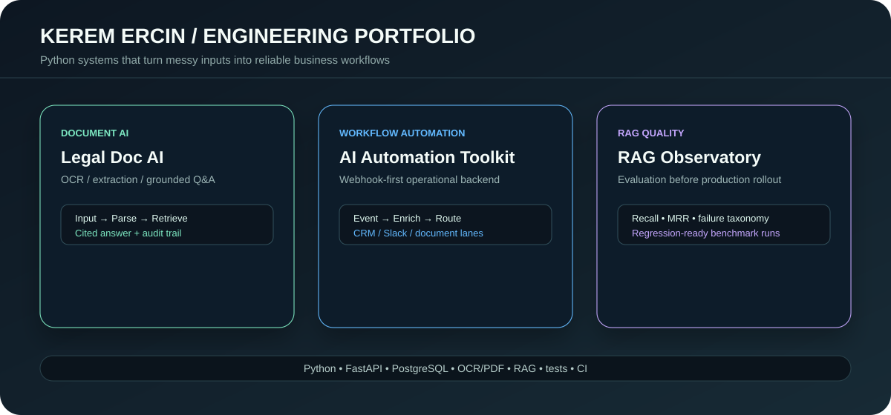
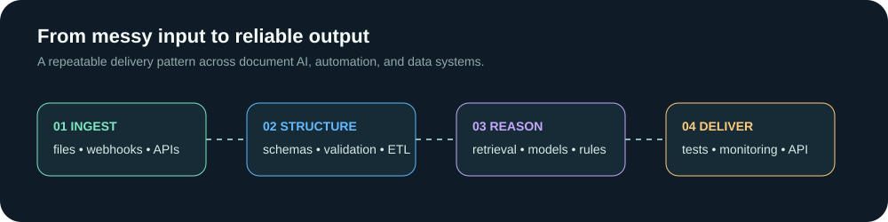

# Kerem Ercin
**Python & AI Automation Engineer | Backend/FastAPI | RAG & Data Extraction**

I build practical Python systems that turn messy documents, web data, and manual workflows into reliable software.

**Open to remote roles and freelance contracts** (Turkey, UTC+3).

### 1. What I Build & The Problems I Solve
- **Document AI & RAG:** I turn unstructured PDFs and text into searchable, cited knowledge bases, solving the problem of siloed or inaccessible company data.
- **Workflow Automation:** I replace fragile manual support and lead intake processes with robust, webhook-first backend services.
- **Data Extraction:** I build reliable scrapers and ETL pipelines to deliver clean, structured data (JSON/CSV/DB) for business intelligence.
- **Production-Ready Backends:** I deliver FastAPI services with clear schemas, automated tests, and observability—not just fragile demos.

### 2. Strongest Proof Projects
See [`PORTFOLIO_INDEX.md`](PORTFOLIO_INDEX.md) for a full matrix of my work.

#### [Legal Document AI Pipeline](https://github.com/keremercin/legal-doc-ai-pipeline)
* **What it is:** OCR/PDF ingestion with hybrid retrieval, grounded Q&A, and citation audit trails.
* **Why it matters:** Gives teams reliable, searchable answers over complex operational documents.

#### [AI Automation Toolkit](https://github.com/keremercin/ai-automation-toolkit)
* **What it is:** Webhook-first backend with explicit payload contracts and failure-mode handling.
* **Why it matters:** Standardizes support summaries, lead enrichment, and document intake without silent failures.

#### [RAG Eval Observatory](https://github.com/keremercin/rag-eval-observatory)
* **What it is:** RAG evaluation API tracking precision/recall/MRR with regression-ready benchmark outputs.
* **Why it matters:** Provides quantitative quality evidence before RAG apps hit production.

#### [E-commerce Price Intel](https://github.com/keremercin/ecommerce-price-intel)
* **What it is:** Data extraction API with snapshot endpoints, alert logic, and dashboard-ready analytics.
* **Why it matters:** Automates noisy, manual price and review monitoring with reliable data delivery.

### 3. Let's Connect
I am available for freelance contracts and remote roles.
- ✉️ **Email:** [ercinkerem54@gmail.com](mailto:ercinkerem54@gmail.com)
- 💼 **LinkedIn:** [linkedin.com/in/keremercin](https://www.linkedin.com/in/keremercin/)
- 💻 **GitHub:** [github.com/keremercin](https://github.com/keremercin)

---
*Weekly write-ups: [How I Evaluate RAG Systems Under Budget Constraints ($0-30)](writeups/2026-02-18-rag-eval-budget.md)*
